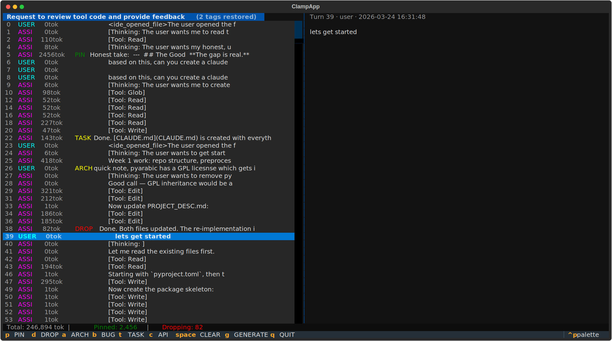
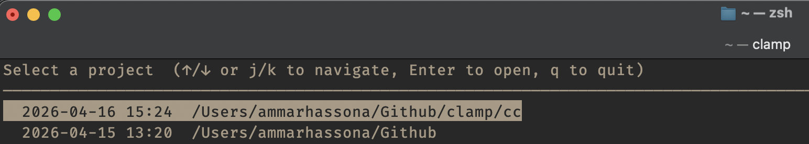

# clamp-cc


clamp-cc is a terminal UI for taking control of Claude Code's context compaction. Instead of letting `/compact` summarize everything blindly, you open the current session, tag the turns that matter like architectural decisions, open bugs, API contracts, things to drop and hit `g` to generate a targeted `/compact` instruction that tells Claude exactly what to keep, what to focus on, and what to throw away. Tags persist between sessions so you don't have to re-tag every time you open a project.

---



---

## Install

```bash
pipx install clamp-cc
```

pipx is the recommended way to install CLI tools on macOS — it creates and manages the virtualenv for you automatically. If you don't have it: `brew install pipx`.

Alternatively, if you prefer managing your own environment:

```bash
python3.11 -m venv .venv
source .venv/bin/activate
pip install clamp-cc
```

## Usage

### Session detection

**Auto-detect from current directory** — if you're inside a project that has a Claude Code session, clamp-cc picks it up automatically:

```bash
cd ~/Github/my-project
clamp
```

**Project picker** — if you're not in a recognized project directory, clamp-cc shows an interactive list of all your Claude Code projects sorted by most recently modified. Use arrow keys to navigate, Enter to open:



**Explicit session file** — point directly at a `.jsonl` session file:

```bash
clamp --session ~/.claude/projects/-Users-you-Github-myproject/abc123.jsonl
```

### Workflow

1. Run `clamp` from your project directory
2. Browse turns with arrow keys — the right panel shows the full content of the selected turn
3. Tag turns using the keybindings below
4. Hit `g` to generate the `/compact` instruction — it's copied to clipboard automatically
5. Paste it into Claude Code, or use tmux integration to send it directly (see below)

## Keybindings

| Key | Action |
|-----|--------|
| `↑` / `↓` | Navigate turns |
| `p` | Tag as **PIN** — always survive compaction (green) |
| `d` | Tag as **DROP** — explicitly discard (red) |
| `a` | Tag as **ARCH** — architecture decision (yellow) |
| `b` | Tag as **BUG** — open bug (yellow) |
| `t` | Tag as **TASK** — task state (yellow) |
| `c` | Tag as **API** — API contract (yellow) |
| `Space` | Clear tag |
| `g` | Generate `/compact` instruction (auto-copies to clipboard) |
| `q` | Quit (asks for confirmation if any turns are tagged) |

The token counter at the bottom updates live as you tag — shows total session tokens, pinned tokens, and tokens being dropped.

## Tagging guide

| Tag | When to use it | Example |
|-----|---------------|---------|
| **PIN** | Decisions that can't be re-derived from the code, things Claude must never lose | "We switched to Postgres because SQLite couldn't handle concurrent writes" |
| **ARCH** | Design choices where the reasoning matters as much as the decision | "Auth is stateless JWT, session state lives in Redis, here's why" |
| **BUG** | Open issues you're mid-fix, enough context to pick back up without re-reading everything | "Parser crashes on empty tool_use blocks, traced to line 47, not fixed yet" |
| **TASK** | Current task state so the next session starts where this one left off | "Finished the modal, next step is wiring the generator to the store" |
| **API** | Contracts, schemas, and interfaces that other parts of the code depend on | "GET /sessions returns `{id, title, mtime}[]`, max 100 results, no pagination yet" |
| **DROP** | Noise, dead ends, and superseded turns that will only confuse the summary | Initial brainstorming that went nowhere, a refactor that got reverted |

## tmux integration

If you're running inside a tmux session, pressing `g` opens a pane picker instead of going straight to the clipboard modal. Select the pane running Claude Code, hit Enter, and clamp-cc fires the `/compact` instruction directly into that pane — no switching windows, no pasting.

<video src="media/tmux.mp4" controls width="100%"></video>

Recommended setup — run Claude Code first, then split and open clamp-cc alongside it:

```bash
# in your existing tmux pane running Claude Code:
tmux split-window -h "cd ~/Github/my-project && clamp"
```

To skip tmux detection and always use the clipboard:

```bash
clamp --no-tmux
```

## How the generated instruction looks

```
/compact Always preserve: [turn 4: "use postgres, not sqlite — decided after..."],
[turn 12: "auth middleware rewrite is blocked on legal sign-off"].
Focus summary on: [turn 7: "GET /sessions returns paginated list, max 100..."],
[turn 19: "open bug: parser crashes on empty tool_use blocks"].
Discard: [turn 2: "initial brainstorm, superseded"], [turn 9: "tangent about..."].
Summarize everything else aggressively.
```

## Tag persistence

Tags are saved to `~/.claude/clamp_cc_tags.db` as you work. When you reopen a session, your tags are restored automatically and the session title shows how many were recovered. Events older than 90 days are trimmed on each open.
